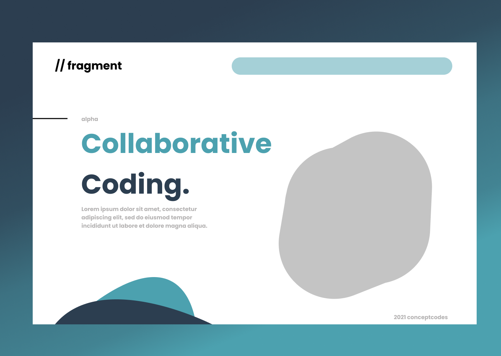

# Fragment - Collaborative Code IDE



## What is Fragment?
This was built to allow me to code with friends. It uses socket.io to allow us to edit the same script in realtime. This way my friends can watch me code while practicing social distancing :), all jokes aside i hope you add fragment as a widget to your website if you frequently code for friends.

## Requirement
- Vue 3
- Node.js

## Usage

Clone it!

```
$ git clone git@github.com:conceptcodes/fragment.git
```

Go into the project directory and run the command:

```
$ yarn install
```

Compiles and minifies for production
```
yarn build
```

Live development server
```
yarn serve
```
Open `http://localhost:8080` and enjoy!


Run your unit tests
```
yarn test:unit
```

Run your end-to-end tests
```
yarn test:e2e
```

Lints and fixes files
```
yarn lint
```
## Roadmap
- add code editor 
- design smart contract
- create ERC-721 smart contract


